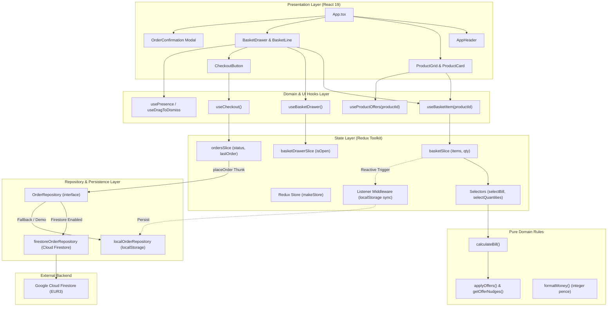
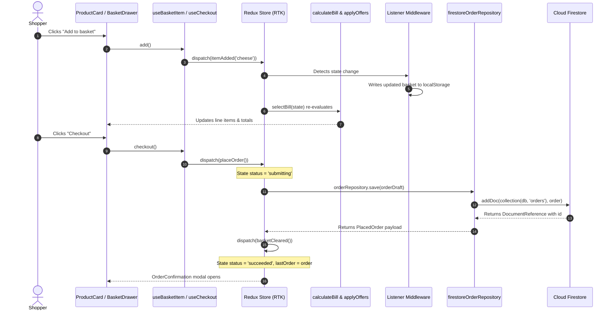

# The Larder – Full Project Architecture & Technical Guide

This document provides a comprehensive breakdown of **The Larder** e-commerce application. It details the design principles, state management with Redux Toolkit, data persistence with Firebase Cloud Firestore, component hierarchy, custom hooks, and a curated learning guide for mastering Redux and Firebase.

---

## 1. High-Level Architecture Overview

The application follows a **Feature-Driven Modular Architecture** built on top of **React 19**, **Redux Toolkit**, **TypeScript**, and **Tailwind CSS v4**.

### Architectural Goals:
1. **Separation of Concerns:** Business rules, pricing calculations, UI rendering, and external integrations (Firestore) are isolated into independent layers.
2. **Zero Floating-Point Inaccuracies:** All monetary calculations use integer pence.
3. **Derived State Over Stored State:** Computed values (discounts, subtotals, active offers) are never stored in Redux; they are derived on the fly using memoized selectors.
4. **Decoupled Infrastructure (Repository Pattern):** Business logic and Redux thunks interact with an abstract `OrderRepository` interface, allowing plug-and-play swapping between Cloud Firestore and `localStorage`.
5. **Code Splitting & Bundle Optimization:** The Firebase SDK is dynamically imported at runtime only when an order is placed and Firestore credentials are provided.

### End-to-End System Architecture



---

## 2. Directory Structure & Organization

```
ecommerce/
├── src/
│   ├── app/                      # Redux store configuration, type definitions, typed hooks
│   │   ├── createAppAsyncThunk.ts # Pre-typed createAsyncThunk wrapper
│   │   ├── hooks.ts              # Typed useAppDispatch and useAppSelector
│   │   └── store.ts              # Root store factory with listener middleware
│   │
│   ├── components/               # Cross-feature and primitive UI components
│   │   ├── layout/               # Header, hero banner
│   │   └── ui/                   # Reusable atomic UI (Button, Modal, Drawer, Price, Render...)
│   │
│   ├── features/                 # Modular business domain features
│   │   ├── basket/               # Shopping basket state, drawer UI, calculations
│   │   │   ├── components/       # BasketDrawer, BasketLine, BasketSummary, etc.
│   │   │   ├── hooks/            # useBasketItem, useBasketDrawer
│   │   │   ├── basketSlice.ts    # Redux slice for basket items
│   │   │   ├── calculateBill.ts  # Pure billing computation engine
│   │   │   ├── selectors.ts      # Memoized selectors (selectBill, etc.)
│   │   │   └── persistence.ts    # LocalStorage basket serialization
│   │   │
│   │   ├── offers/               # Promotional deals and shopper nudges
│   │   │   ├── applyOffers.ts    # Evaluates discounts (BOGOF, linked, percent off)
│   │   │   ├── getOfferNudges.ts # Computes product card deal messages
│   │   │   └── offers.ts         # Central offer configuration dataset
│   │   │
│   │   ├── orders/               # Order submission, repositories, checkout
│   │   │   ├── components/       # CheckoutButton, OrderConfirmation
│   │   │   ├── hooks/            # useCheckout
│   │   │   ├── ordersSlice.ts    # Async checkout thunk and slice
│   │   │   ├── repositories/     # Firestore vs Local storage repositories
│   │   │   └── toOrderDraft.ts   # Bill-to-order serialization
│   │   │
│   │   └── products/             # Catalog and product presentation
│   │       ├── catalog.ts        # Hardcoded product definitions
│   │       └── components/       # ProductGrid, ProductCard, ProductThumb
│   │
│   ├── hooks/                    # Shared low-level React hooks (animations, a11y)
│   ├── lib/                      # Core helpers (Firebase client, money, class merging)
│   ├── App.tsx                   # Top-level application shell
│   └── main.tsx                  # Application bootstrap & Redux Provider setup
│
├── firestore.rules               # Firestore security and validation rules
├── firebase.json                 # Firebase Hosting & emulator configuration
└── package.json
```

---

## 3. Redux State Management

State in this application is intentionally minimal, predictable, and fully typed using Redux Toolkit (`@reduxjs/toolkit`).

### 3.1 Store Configuration (`src/app/store.ts`)

Instead of exporting a global singleton store, the app provides a `makeStore()` factory:
- Facilitates unit testing with fresh, isolated state per test.
- Allows injecting preloaded state (e.g. restoring saved basket from `localStorage`).
- Injects dependencies like `orderRepository` via Thunk extra arguments.

```typescript
export function makeStore({
  preloadedState,
  orderRepository = createOrderRepository(),
  persist = false,
}: StoreOptions = {}) {
  const listener = createListenerMiddleware<RootState>()

  if (persist) {
    listener.startListening({
      predicate: (_action, current, previous) => current.basket !== previous.basket,
      effect: (_action, api) => saveBasket(api.getState().basket),
    })
  }

  return configureStore({
    reducer: rootReducer,
    preloadedState,
    middleware: (getDefaultMiddleware) =>
      getDefaultMiddleware({ thunk: { extraArgument: { orderRepository } } }).prepend(
        listener.middleware,
      ),
  })
}
```

### 3.2 The Slices

| Slice | File | Responsibility |
|---|---|---|
| `basket` | `src/features/basket/basketSlice.ts` | Tracks `items: { productId, quantity }[]`. Handles `itemAdded`, `itemDecremented`, `itemRemoved`, `basketCleared`. Caps max quantity at 99. |
| `basketDrawer` | `src/features/basket/basketDrawerSlice.ts` | Controls whether the shopping basket drawer/sheet is open (`isOpen: boolean`). |
| `orders` | `src/features/orders/ordersSlice.ts` | Tracks checkout lifecycle status (`'idle' | 'submitting' | 'succeeded' | 'failed'`), `lastOrder`, and `error`. |

### 3.3 Derived State via Reselect (`src/features/basket/selectors.ts`)

**Anti-Pattern Avoided:** Storing calculated totals (subtotal, savings, total price) in the Redux store. Storing derived state leads to synchronization bugs when items change.

**Solution:** The basket slice stores *only* the raw product IDs and quantities. The bill is computed via a memoized selector (`selectBill`):

```typescript
export const selectBill = createSelector(
  [selectBasketItems], 
  (items) => calculateBill(items)
)
```

`calculateBill`:
1. Converts basket items into line items with unit prices.
2. Applies discounts via `applyOffers()`.
3. Returns line-by-line subtotals, savings, and final gross total.
4. Because it is memoized with `createSelector`, recalculations only happen when `state.basket.items` changes reference.

### 3.4 Listener Middleware for Automatic Persistence

Rather than dispatching manual storage operations inside React components or reducers, RTK's `createListenerMiddleware` observes state transitions:
- Whenever `current.basket !== previous.basket`, it writes the basket to `localStorage`.
- On application startup (`src/main.tsx`), `loadBasket()` initializes the store with any existing basket.

---

## 4. How Data Is Saved in Firebase Cloud Firestore

The project features a decoupled, production-ready Cloud Firestore integration.

### 4.1 The Repository Pattern (`src/features/orders/repositories/`)

The application defines an interface (`OrderRepository`):

```typescript
export interface OrderRepository {
  save(order: OrderDraft): Promise<PlacedOrder>
}
```

Two concrete implementations fulfill this contract:
1. `firestoreOrderRepository`: Saves the document to Firestore using the official Firebase SDK.
2. `localOrderRepository`: Generates an ID locally and saves to `localStorage` (for offline development or when no Firebase keys are set).

### 4.2 Dynamic Lazy Loading

To keep initial bundle sizes low, Firebase is **not** loaded on page load. In `src/features/orders/repositories/index.ts`:

```typescript
const lazyFirestoreRepository: OrderRepository = {
  async save(order) {
    const { firestoreOrderRepository } = await import('./firestoreOrderRepository')
    return firestoreOrderRepository.save(order)
  },
}

export function createOrderRepository(): OrderRepository {
  return isFirestoreEnabled ? lazyFirestoreRepository : localOrderRepository
}
```
If `VITE_FIREBASE_PROJECT_ID` is defined, the app loads `firestoreOrderRepository` on-demand when the shopper clicks Checkout. Otherwise, it falls back to `localOrderRepository`.

### 4.3 Saving an Order to Cloud Firestore (`src/features/orders/repositories/firestoreOrderRepository.ts`)

```typescript
export const firestoreOrderRepository: OrderRepository = {
  async save(order) {
    const ref = await addDoc(collection(getDb(), 'orders'), {
      ...order,
      createdAt: serverTimestamp(),
    })
    return { ...order, id: ref.id, createdAt: new Date().toISOString() }
  },
}
```

1. **`getDb()`** (`src/lib/firebase.ts`): Lazily initializes the Firebase App and returns the `Firestore` database instance (singleton).
2. **`collection(getDb(), 'orders')`**: Points to the `orders` collection.
3. **`addDoc(...)`**: Creates a new document with an auto-generated Firestore document ID.
4. **`serverTimestamp()`**: Uses the Google Cloud server's real clock to prevent client-side clock tampering.

### 4.4 Thunk Execution Flow (`placeOrder`)

In `src/features/orders/ordersSlice.ts`:

```typescript
export const placeOrder = createAppAsyncThunk(
  'orders/place',
  async (_, { getState, dispatch, extra, rejectWithValue }) => {
    try {
      const order = await extra.orderRepository.save(toOrderDraft(selectBill(getState())))
      dispatch(basketCleared())
      return order
    } catch (error) {
      return rejectWithValue('We couldn’t place your order. Please try again.')
    }
  },
  {
    condition: (_, { getState }) => {
      const { basket, orders } = getState()
      return basket.items.length > 0 && orders.status !== 'submitting'
    },
  },
)
```

- **Guard (`condition`):** Prevents duplicate submissions if already submitting or if the basket is empty.
- **Dependency Injection:** Accesses `extra.orderRepository`, keeping Redux code completely agnostic of Firebase.
- **On Success:** Automatically dispatches `basketCleared()` and updates `state.lastOrder`.

### 4.5 Firestore Security Rules (`firestore.rules`)

Public e-commerce storefronts must protect sensitive order data:

```javascript
rules_version = '2';

service cloud.firestore {
  match /databases/{database}/documents {
    match /orders/{orderId} {
      // Shoppers can create an order if it matches the required schema
      allow create: if request.resource.data.keys().hasAll(['lines', 'subtotal', 'totalSavings', 'total', 'createdAt'])
        && request.resource.data.lines is list
        && request.resource.data.lines.size() > 0
        && request.resource.data.total is int
        && request.resource.data.total >= 0
        && request.resource.data.createdAt == request.time;

      // Critical: Orders can NEVER be read, updated, or deleted by clients
      allow read, update, delete: if false;
    }

    match /{document=**} {
      allow read, write: if false;
    }
  }
}
```

- **Write-Only / Create-Only:** Clients can insert orders, but cannot read orders belonging to other customers.
- **Schema Validation:** Verifies required fields and integer types.
- **Timestamp Integrity:** Guarantees `createdAt == request.time`.

---

## 5. Component Architecture & Hierarchy

Components follow a structured hierarchy dividing reusable atomic UI from domain-specific feature widgets.

### 5.1 Layout & Top-Level Shell
- **`App.tsx`**: Assembles the page structure: `AppHeader`, `Hero`, `ProductGrid`, `MobileBasketBar`, `BasketDrawer`, and `OrderConfirmation`.
- **`AppHeader.tsx`**: Displays the brand logo, live item count badge, and a button to toggle the basket drawer.
- **`Hero.tsx`**: Editorial banner introducing the store and active deals.

### 5.2 UI Primitives (`src/components/ui/`)
- **`Button.tsx`**: Polymorphic, accessible button supporting primary, secondary, ghost, and danger variants with loading states.
- **`QuantityStepper.tsx`**: Increment/decrement control with keyboard support, haptic-friendly buttons, and bounds clamping.
- **`Drawer.tsx`**: Accessible slide-out overlay (right-side drawer on desktop, bottom sheet on mobile) supporting swipe-to-dismiss, backdrop click, and escape key.
- **`Modal.tsx`**: Accessible dialog box with focus trapping and body scroll locking.
- **`Price.tsx`**: Formats integer pence into standard GBP (`£X.XX`), supporting strikethrough styling for discounted original prices.
- **`Render.tsx`**: Declarative conditional rendering utility (`<Render when={condition}>`).

### 5.3 Feature Components
- **`ProductGrid.tsx` & `ProductCard.tsx`**: Renders catalog products with `ProductThumb` (custom SVG illustrations), prices, add-to-cart buttons, and dynamic promotional nudges.
- **`BasketDrawer.tsx`**: Contains the full shopping basket list:
  - **`BasketLine.tsx`**: Renders individual items with their quantity stepper, subtotals, and applied offer badges.
  - **`BasketSummary.tsx`**: Renders subtotal, itemized discount lines, and final grand total.
  - **`CheckoutButton.tsx`**: Triggers the `placeOrder` thunk with loading spinner integration.
- **`OrderConfirmation.tsx`**: Displays order breakdown, order ID, items list, and final total upon successful Firestore submission.

---

## 6. Custom Hooks Architecture

The project organizes hooks into **Redux typed hooks**, **feature/domain hooks**, and **low-level UI hooks**.

### 6.1 Redux Hooks (`src/app/hooks.ts`)
- **`useAppDispatch`**: Typed version of `useDispatch<AppDispatch>()`.
- **`useAppSelector`**: Typed version of `useSelector<RootState>()`.

### 6.2 Feature & Domain Hooks

#### `useBasketItem(productId)` (`src/features/basket/hooks/useBasketItem.ts`)
Encapsulates all actions for a specific product inside the basket:
```typescript
const { quantity, add, decrement, remove } = useBasketItem('cheese')
```
Components don't need to know about Redux actions; they just call `add()` or `decrement()`.

#### `useBasketDrawer()` (`src/features/basket/hooks/useBasketDrawer.ts`)
Provides clean controls for the drawer state:
```typescript
const { isOpen, open, close, toggle } = useBasketDrawer()
```

#### `useProductOffers(productId)` (`src/features/basket/hooks/useProductOffers.ts`)
Computes active deals and "smart nudges" for a given product card:
- Tells the user if an offer is already applied: *"1 free cheese applied · You save £0.90"*
- Tells the user how to trigger the next deal: *"Add 1 more cheese – it's free!"* with a 1-click action.

#### `useCheckout()` (`src/features/orders/hooks/useCheckout.ts`)
Exposes checkout actions and status indicators:
```typescript
const { checkout, dismiss, isSubmitting, isConfirmed, lastOrder, error } = useCheckout()
```

### 6.3 Low-Level Interaction & Accessibility Hooks (`src/hooks/`)

| Hook | Purpose |
|---|---|
| `usePresence(isOpen)` | Manages mount/unmount animations, preventing DOM elements from unmounting until exit CSS transitions complete. |
| `useBodyScrollLock(isLocked)` | Disables `overflow: hidden` on `document.body` when drawers or modals are open to prevent background scrolling. |
| `useDragToDismiss(onDismiss)` | Enables mobile touch gestures to drag down the bottom sheet to dismiss it. |
| `useEscapeKey(handler)` | Listens for keyboard `Escape` key events to close overlays. |
| `useRestoreFocus(isOpen)` | Stores the active element before opening a modal/drawer and returns focus back upon closure for keyboard accessibility. |
| `useLastNonEmpty(value)` | Holds onto the last non-empty value (e.g. basket items or order data) so closing animations don't flash empty content. |

---

## 7. Complete Data Flow Walkthrough



---

## 8. Learning Guide & Resources: Redux & Firebase

To expand your mastery of Redux Toolkit and Firebase Cloud Firestore, explore the curated links, documentation, and topics below.

### 8.1 Redux & Redux Toolkit (RTK)

#### Core Documentation & Guides
- [Redux Essentials Official Tutorial](https://redux.js.org/tutorials/essentials/part-1-overview-concepts) – The gold-standard step-by-step introduction to modern Redux with Redux Toolkit.
- [Redux Toolkit (RTK) Quick Start](https://redux-toolkit.js.org/tutorials/quick-start) – How to configure a store, create slices, and read/write state with typed hooks.
- [createAsyncThunk Guide](https://redux-toolkit.js.org/api/createAsyncThunk) – Detailed guide on handling async logic, promises, and status lifecycles (`pending`, `fulfilled`, `rejected`).
- [createListenerMiddleware](https://redux-toolkit.js.org/api/createListenerMiddleware) – A lightweight, modern alternative to Redux Saga and Redux Observable for reactive side effects.
- [Reselect & createSelector](https://redux-toolkit.js.org/api/createSelector) – How memoized selectors prevent unnecessary component re-renders.

#### Recommended Video Courses & Tutorials
- [Dave Gray: Redux Toolkit Full Course (YouTube)](https://www.youtube.com/watch?v=NqzdVN2tyvQ) – Practical, end-to-end breakdown of RTK slices, async thunks, and best practices.
- [Codevolution: Redux Toolkit Tutorial Playlist (YouTube)](https://www.youtube.com/playlist?list=PLC3y8-rFHvwiaOAuTtVXittwybYIorn35) – Bite-sized concepts from setup to complex state.

#### Key Redux Concepts to Master:
1. **Normalized State:** Storing relational entities by ID rather than nested arrays.
2. **Immutable Updates with Immer:** How RTK lets you write "mutative" syntax like `state.items.push()` safely under the hood.
3. **Thunk Dependency Injection:** Using `thunk.extraArgument` to decouple APIs and repositories from state logic.

---

### 8.2 Firebase & Cloud Firestore

#### Core Documentation & Guides
- [Firebase Web Getting Started](https://firebase.google.com/docs/web/setup) – Setting up Firebase in modern build tools like Vite.
- [Cloud Firestore Data Model](https://firebase.google.com/docs/firestore/data-model) – Understanding collections, documents, subcollections, and schema design.
- [Adding Data to Firestore](https://firebase.google.com/docs/firestore/manage-data/add-data) – Using `addDoc`, `setDoc`, and `serverTimestamp`.
- [Cloud Firestore Security Rules](https://firebase.google.com/docs/firestore/security/get-started) – Writing rules to secure reads, validate incoming payloads, and enforce authorization.
- [Firestore Security Rules Reference](https://firebase.google.com/docs/reference/rules/firestore) – Grammar, built-in functions, and request/resource objects.

#### Recommended Video Courses & Tutorials
- [Fireship: Firebase - The Ultimate Beginners Guide (YouTube)](https://www.youtube.com/watch?v=9kRgVxULbag) – Fast-paced, high-level walkthrough of Firebase features.
- [Net Ninja: Firestore Tutorial Playlist (YouTube)](https://www.youtube.com/playlist?list=PL4cUxeGkcC9itfjle0ReBCxFITRIJS6Yk) – Comprehensive step-by-step series on Firestore CRUD operations and security rules.

#### Key Firebase Concepts to Master:
1. **Firestore Data Modeling:** Denormalization vs. subcollections, query performance, and indexing.
2. **Security Rules Validation:** Writing declarative tests for security rules using the `@firebase/rules-unit-testing` emulator suite.
3. **Optimistic Updates & Offline Persistence:** How Firestore handles local caching and syncing when returning online.

---

## 9. Summary of Key Architectural Decisions

| Aspect | Decision | Rationale |
|---|---|---|
| **Currency** | Integer pence | Completely avoids `0.1 + 0.2 = 0.30000000000000004` floating-point math bugs. |
| **Totals & Bill** | Pure functions + Memoized Selectors | Derived state is calculated on demand, guaranteeing zero desynchronization between item quantities and price totals. |
| **Firebase Loading** | Dynamic lazy import | Firebase SDK is only imported when checking out, keeping initial page loads fast. |
| **Data Access** | Repository pattern | Allows running in offline/demo mode without Firebase credentials, and enables simple mocking in automated tests. |
| **Persistence** | Listener Middleware | Keeps persistence out of UI components and pure reducers while reacting immediately to basket changes. |
| **Security** | Create-only Firestore rules | Enables shoppers to place orders without exposing other shoppers' orders to public read queries. |
